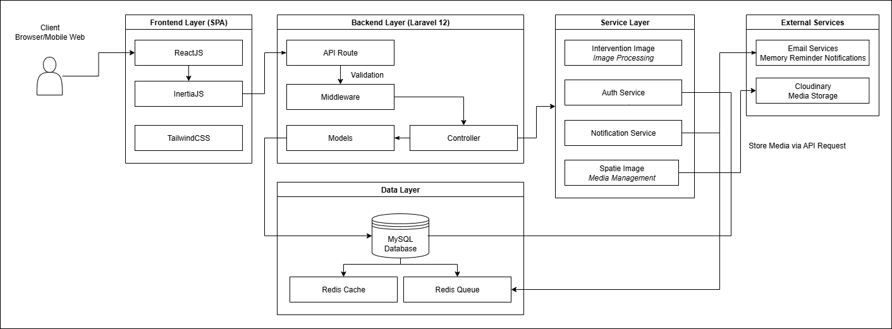

## Latar Belakang
Kita semua sering mengabadikan momen berharga bersama teman dan keluarga, hanya untuk akhirnya foto-foto tersebut tertimbun di galeri ponsel atau Google Drive. Saat ingin bernostalgia, kita kesulitan menemukan foto yang dicari karena berantakan dan tidak terorganisir. MyKisah hadir untuk mengubah cara kita menyimpan dan merasakan kembali kenangan.

## Fitur (MVP)
  ### Timeline Interaktif
  - Menampilkan foto berdasarkan kronologi waktu
  - Tampilan visual yang menarik dan navigasi yang mudah
  - Filter berdasarkan tahun/bulan/tanggal

  ### Cerita dibalik foto
  - Tambahkan deskripsi/cerita untuk setiap foto
  - Update/edit cerita kapan aja

  ### Album Tematik
  - Kelompokkan foto ke dalam album berdasarkan tema
  - Buat album untuk acara spesial (wisuda, liburan, ulang tahun)
  - Berbagi album dengan teman dan keluarga

  ### Hall of Fame (Momen Favorit)
  - Koleksi khusus untuk foto-foto terbaik
  - Fitur pin untuk menandai momen paling berkesan
  - Akses cepat ke kenangan paling berharga

  ### Pengingat Kenangan
  - Notifikasi "On This Day" untuk momen spesifik
  - Berbagi otomatis kenangan lewat email
  - Fitur nostalgia kenangan

## Arsitektur Teknis
  ### Backend Stack
  ```
  Laravel 12 (PHP Framework)
  MySQL (Database)
  Redis (Cache & Queue)
  Cludinary (Penyimpanan Media)
  ``` 
  ### Frontend Stack
  ```
  Tailwind CSS
  InertiaJS
  ReactJS
  ```
  ### Package Tambahan
  ```
  Intervention Image (Image Processing)
  Spatie Media Library (Media Management)
  ```
  

