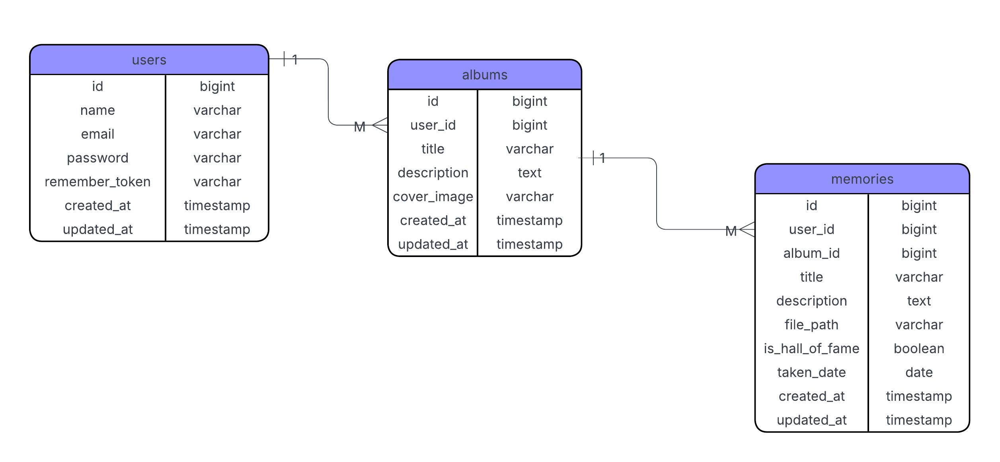

## ENTITY RELATIONSHIP DIAGRAM

1. Entitas dan Atribut
 a. users
    -id (bigint, Primary Key)
    -name (varchar) — Nama pengguna
    -email (varchar) — Email pengguna, harus unik
    -password (varchar) — Password pengguna
    -remember_token (varchar) — Token untuk "remember me" autentikasi
    -created_at (timestamp) — Waktu pembuatan record
    -updated_at (timestamp) — Waktu update record terakhir

| Field          | Tipe      | Keterangan                      |
| -------------- | --------- | ------------------------------- |
| id             | bigint    | Primary Key                     |
| name           | varchar   | Nama pengguna                   |
| email          | varchar   | Email pengguna (unik)           |
| password       | varchar   | Password pengguna               |
| remember_token | varchar   | Token untuk fitur “remember me” |
| created_at     | timestamp | Waktu pembuatan record          |
| updated_at     | timestamp | Waktu update terakhir           |

 b. albums
    -id (bigint, Primary Key)
    -user_id (bigint, Foreign Key) — Mengacu ke users.id, menunjukkan pemilik album
    -title (varchar) — Judul album
    -description (text) — Deskripsi album
    -cover_image (varchar) — Path atau URL gambar sampul album
    -created_at (timestamp) — Waktu pembuatan album
    -updated_at (timestamp) — Waktu update album terakhir

| Field       | Tipe      | Keterangan                             |
| ----------- | --------- | -------------------------------------- |
| id          | bigint    | Primary Key                            |
| user_id     | bigint    | Foreign Key → users.id (pemilik album) |
| title       | varchar   | Judul album                            |
| description | text      | Deskripsi album                        |
| cover_image | varchar   | Path/URL gambar sampul                 |
| created_at  | timestamp | Waktu pembuatan album                  |
| updated_at  | timestamp | Waktu update terakhir                  |

c. memories
    -id (bigint, Primary Key)
    -user_id (bigint, Foreign Key) — Mengacu ke users.id, menunjukkan pemilik moment kenangan
    -album_id (bigint, Foreign Key) — Mengacu ke album.id tempat kenangan ini berada
    -title (varchar) — Judul kenangan
    -description (text) — Cerita atau deskripsi kenangan/foto
    -file_path (varchar) — Path atau URL file foto/video
    -is_hall_of_fame (boolean) — Menandai apakah kenangan termasuk momen favorit/hall of fame
    -taken_date (date) — Tanggal pengambilan foto/video
    -created_at (timestamp) — Waktu pembuatan entry kenangan
    -updated_at (timestamp) — Waktu update terakhir entry kenangan

| Field           | Tipe      | Keterangan                                     |
| --------------- | --------- | ---------------------------------------------- |
| id              | bigint    | Primary Key                                    |
| user_id         | bigint    | Foreign Key → users.id (pemilik kenangan)      |
| album_id        | bigint    | Foreign Key → album.id (album tempat kenangan) |
| title           | varchar   | Judul kenangan                                 |
| description     | text      | Cerita atau deskripsi kenangan                 |
| file_path       | varchar   | Path/URL foto atau video                       |
| is_hall_of_fame | boolean   | Apakah termasuk momen favorit (Hall of Fame)   |
| taken_date      | date      | Tanggal pengambilan foto/video                 |
| created_at      | timestamp | Waktu pembuatan kenangan                       |
| updated_at      | timestamp | Waktu update terakhir                          |

2. Relasi dan Kardinalitas
| Entitas Asal | Entitas Tujuan | Jenis Hubungan | Kardinalitas              | Penjelasan                                        |
| ------------ | -------------- | -------------- | ------------------------- | ------------------------------------------------- |
| **Users**    | **Album**      | One-to-Many    | 1 user → banyak album     | Satu pengguna dapat memiliki banyak album         |
| **Users**    | **Memories**   | One-to-Many    | 1 user → banyak memories  | Satu pengguna dapat memiliki banyak kenangan      |
| **Album**    | **Memories**   | One-to-Many    | 1 album → banyak memories | Satu album dapat berisi banyak kenangan atau foto |

penjelasan:
a. Relasi antara Users dan Album (One-to-Many)
   -Satu pengguna (User) dapat memiliki banyak album.
   -Ini direpresentasikan dengan adanya kolom user_id di tabel Album yang merupakan foreign key ke id di tabel Users.
   -Kardinalitasnya adalah 1 user : banyak album.

b. Relasi antara Users dan Memories (One-to-Many)
   -Satu pengguna dapat memiliki banyak kenangan (Memories).
   -Kolom user_id di tabel Memories menjadi foreign key yang mengacu ke id di Users.
   -Kardinalitasnya adalah 1 user : banyak memories.

c. Relasi antara Album dan Memories (One-to-Many)
   -Satu album dapat berisi banyak kenangan (Memories).
   -Kolom album_id di tabel Memories menjadi foreign key yang mengacu ke id di tabel Album.
   -Kardinalitasnya adalah 1 album : banyak memories.

3. Diagram
   